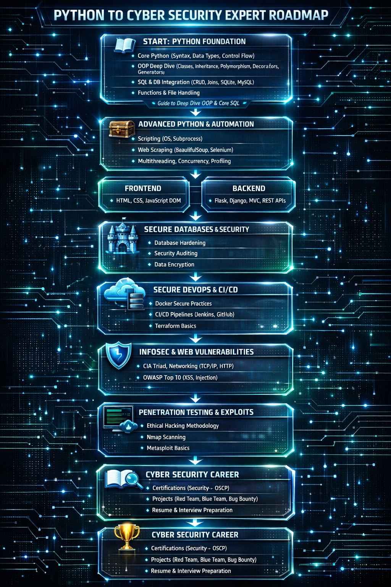

# 🚀 Python to Cyber Security Journey

Welcome to my learning journey from **Python Developer** to **Cyber Security Engineer** 👨‍💻🛡️

This repository tracks my step-by-step progress as I learn, build, and practice real-world projects in **Python Development**, **Automation**, **Web Development**, and **Cyber Security**.

## 📚 Topics Covered

### 🐍 01 - Python Foundation

* Core Python
* OOP (Object-Oriented Programming)
* Decorators & Generators
* SQL & Database Integration

### 🤖 02 - Advanced Python & Automation

* OS / Shutil / Subprocess
* File Automation Scripts
* Web Scraping
* Multithreading & Concurrency

### 🌐 03 - Web Development

* HTML, CSS, JavaScript
* Flask
* Django
* REST APIs

### 🔐 04 - Cyber Security Labs

* Encryption Scripts
* Networking Tools
* Vulnerability Testing
* Penetration Testing Basics

## 🎯 Goal

My goal is to become a skilled **Python Developer** and **Cyber Security Engineer** by building projects and solving real-world problems.

## 📈 Progress

I update this repository regularly as I learn new concepts and create new projects.

⭐ Follow my journey and feel free to explore my work!
